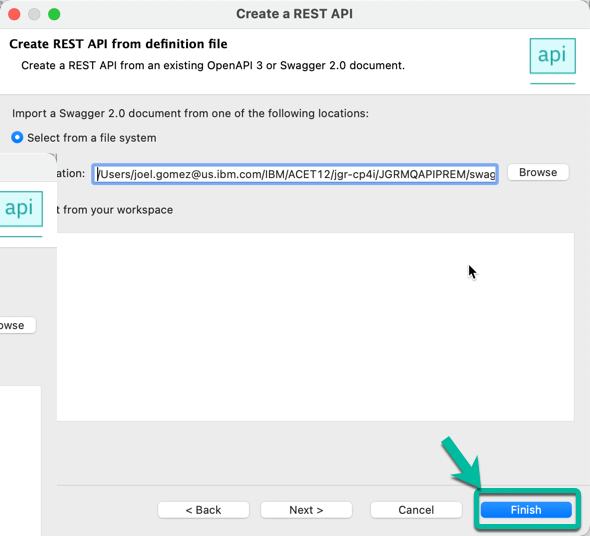
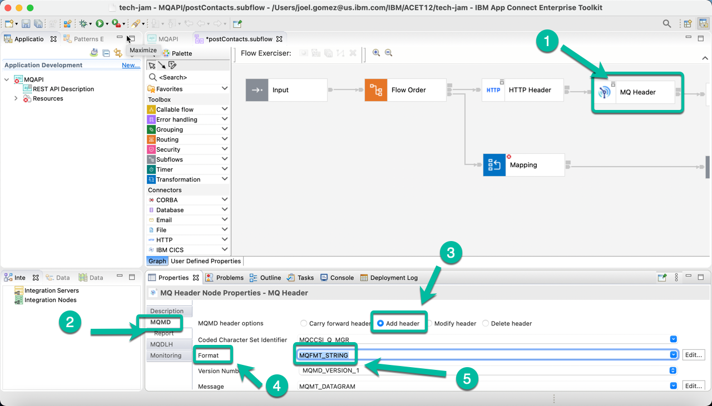
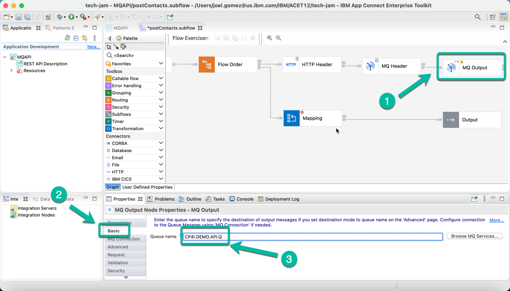
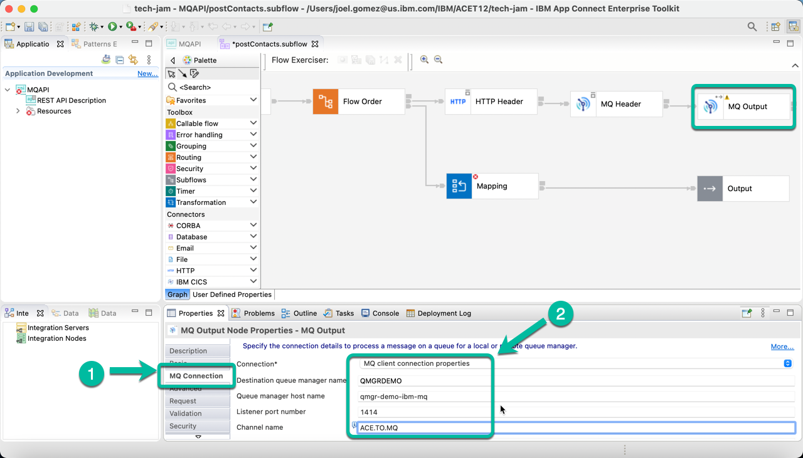
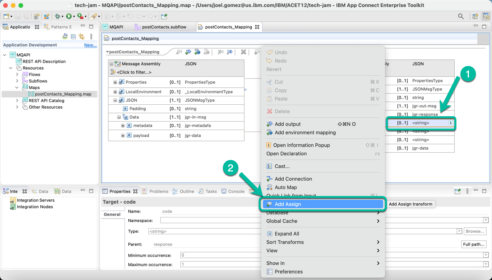
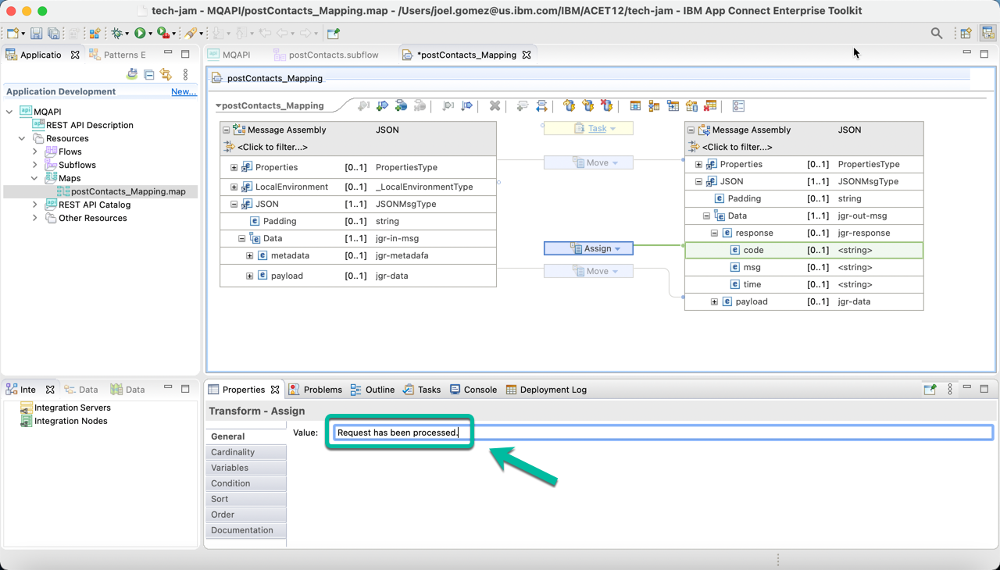
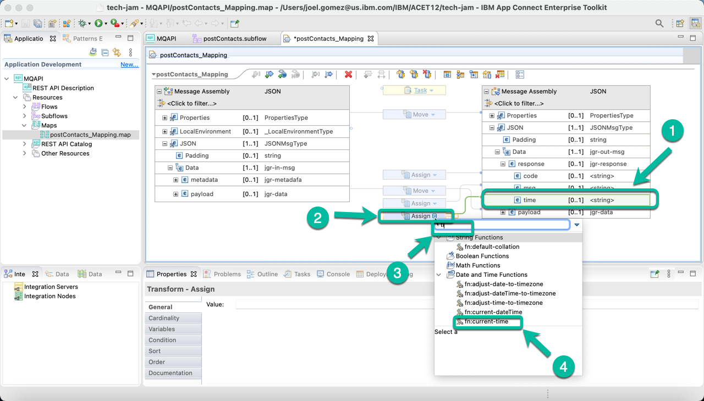
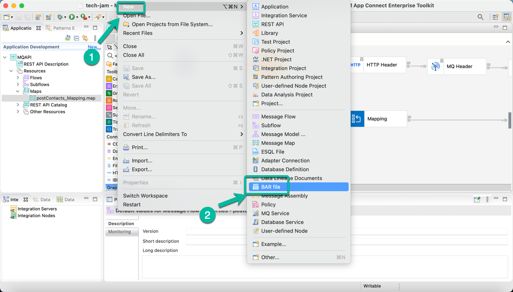
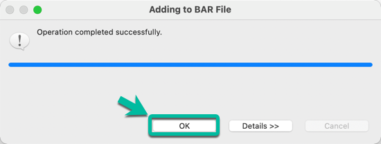

# Develop a REST API using ACE Toolkit to interact with MQ.

This article explains the steps need to create an Integration Flow developed with *ACE Toolkit* that uses the *REST API* functionality as well as the *MQ Nodes* to interact with an **MQ Queue Manager** using the latest version of the **ACE Integration Server Certified Container (ACEcc)** as part of the *IBM Cloud Pak for Integration (CP4I)*.

## Low Code / No Code Development with ACE Toolkit.

1. Open the Toolkit in your workstation and create a new REST API project as shown below.

2. Give a name to your project, i.e. *MQAPI* and then select the option to *Import resources* since we will leverage a definition already created.

3. In the wizard click *Browse* and navigate to the location where the OpenAPI file definition is located.

4. Once the path is displayed in the *Location* field click *Finish*.

5. The REST API will be displayed, scroll to the right if needed to open the sunflow operation as shown in the image to proceed to implement the API logic.

6. The *Message Flow Editor* will be open with only the *Input* and *Output* terminals. Double click the tab to maximize the editor and work with the flow.

7. Drag and drop the *Nodes* from the palette to implemeng the "logic". In this case we will use the following nodes:
  * Flow Order Node,
  * HTTP Header Node,
  * MQ Header Node,
  * MQ Output Node, and
  * Mapping Node.

    And you will proceed to wire them. The flow should look like the one below. Once you are done double click the tab again in order to access the properties for each node.

8. Now we will configure each node, starting with the *HTTP Header Node*. Click on it to bring it to focus and then select the *HTTP Input* tab followed by the *Delete header* option as shown below.

9. Now select the *MQ Header Node* and navigate to the *MQMD* tab enabling the *Add header* option. And selecting *MQMFT_STRING* for the *Format* field as shown below.

10. Then select the *MQ Output Node* and in the *Basic* tab enter the name of the queue we will use to put the messages, in this case *CP4I.DEMO.API.Q*

11. In the same *MQ Output Node* navigate to the *MQ Connection* tab enter the information to connect to the Queue Manager. The information is based on the configuration we used for MQ, and for simplicity is included below.

Property | Value
---------|-------
Connection | ***MQ client connection properties***
Destination queue manager name | ***QMGRDEMO***
Queue manager host name | ***qmgr-demo-ibm-mq***
Listener port number | ***1414***
Channel name | ***ACE.TO.MQ***

12. Now double click the *Mapping Node*,

13. In the wizard window simply click *Finish*.

14. Expand the *JSON* section in both the input and output message assemblies and connect the *payload* as shown below.  

15. Then *right click* the *code* field and select *Add Assign* from the menu.

16. In the properties section enter ***CP4I0000*** in the *value* field.

17. Repeat the same process for field *msg* and assign the value ***Request has been processed***

18. Do the same for field *time* but this time we will replace the *Assign* option with the *current-time* function as shown below.

19. The integration flow is completed. Save your progress and close the *mapping* tab.

20. Now we will generate the BAR file that we will use to deploy the Integration into CP4I. From the *File* menu select *New* and then *BAR file* as shown below.

21. In the pop up window enter the name of the BAR file, in this case ***CP4IACEMQAPIPREM***. And then click *Finish*.

22. Click *OK* in the confirmation window and the BAR file is ready to be deployed.

