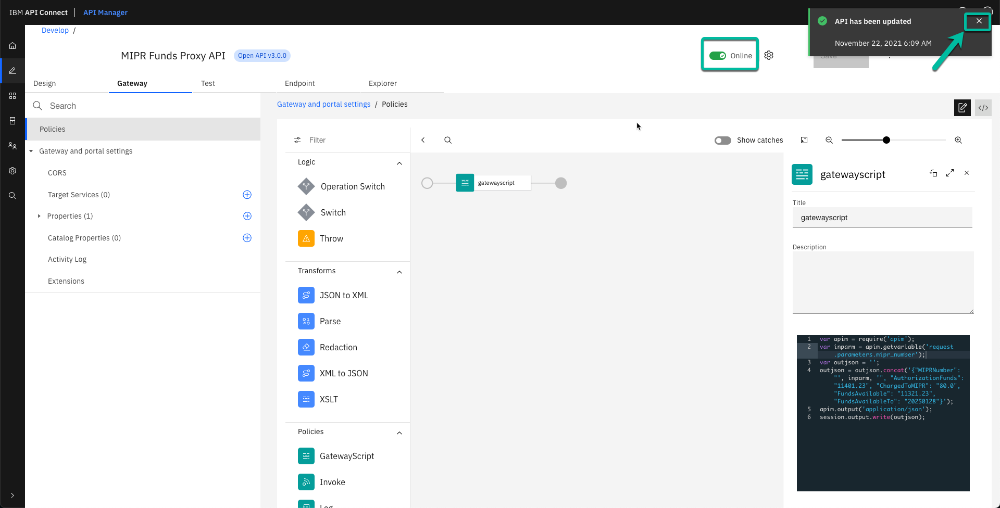

# How to create a micro-integration and an api proxy using IBM Integration Platform running on AWS Elastic Kubernetes Service (EKS)

This document explains the steps needed to create the required artifacts in App Integration and API Management capabilities of IBM's Integration Platform using an existing OpenAPI v3.0 specification.


## Micro-Integration

### Development process
To build the micro-integration we will use the App Connect Enterprise Toolkit, and for the purpose if this article I will simply call it **Toolkit**. 

The instructions assume the **Toolkit** is already installed in the developer workstation. You can follow the instructions listed in the following link to download it and start following the instructions right away: [https://www.ibm.com/docs/en/app-connect/12.0?topic=enterprise-download-ace-developer-edition-get-started](https://www.ibm.com/docs/en/app-connect/12.0?topic=enterprise-download-ace-developer-edition-get-started)

* After you start the Toolkit you will see the following screen. Click on the **New** link as shown to start your project.


* A menu will open with the most common artifacts you can create. In this case you will select **REST API**.


* A wizard will open to create the API. First enter the name, it can be anything meaningful to you, in this example it is **dlaapi**. And since we already have an OpenAPI file you will select **Import resources and operations defined in a REST API document** as shown. Then you will click **Next**.
 


* In the next window keep the option to **Select from a file system** and click **Browse**.


* In the dialog navigate to the location where you have the OpenApi document and open it. The following image is shown as a reference.


* You will be returned to the original window where the **Location** will be updated with the file path. Click **Finish** to get the project created using the existing OpenAPI document.


* You will notice the project is reporting a problem, this is caused by an ambiguity in the OAI3 specification related to the way to hanlde brackets. I'm in conversations with the Deevlopment Team, but for now we will workaround this minor issue to complete the activity. For that click on **Edit API Document in OpenAPI Editor** to make a quick change to the original document.
 


* Click **OK** if you receive a confirmation window informing the editior will be open in a separate window.


* Make sure the new window is on focus and click on the icon to switch from **Design** view to **Code** view as shown in the picture.


* Once in the **Code** view navigate to the section where the **paths** are specified as shown in the picture. 


* Remove the brakets around the parameter and replace it by a slash and then click **Save**.


* Dismiss the notification clicking on the **X** as shown below.


* Now we can close the **OpenAPI Editor**.


* When you go back to the **Toolkit** you can see that the error has disappeard. You can click now in the **Create subflow** botton to implement the micro-integration logic.


* The **Flow Editor** will open. You can see the **Input** and **Output** Nodes are already created for you. You will create the integration logic using a graphical approach. In this case we will produce a simple output, but you could leverage any of the connectors to integrate with any real backend system, but for now expand the **Transormation** drawer.


* First find and select the **Mapping** node. Then drag and drop it between the other two nodes. Then wire the **Input** node with the **Mapping** node and do the same between the **Mapping** and **Output** nodes. Finally double click the **Mapping** node. 
 


* A wizard to create a new map is started. In this case you can use the defaults and simply click **Finish**.


* The graphical mapper is opened to assist creating the response. It will automatically create the output based on the response defined in the OpenAPI document and it creats a **Task** with the suggested activity to take action based on the input parameters, in this case only one.


* First expand the **LocalEnvironment** section in the **Input Message Assembly**. Then expand the **JSON** section followed by the **Data** section in the **Output Message Assembly** to visualize the response message.


* Scroll down in the window until you find the **REST** section in the **Inout Message Assembly** and proceed to expand it. Then expand the **Input** section followed by the **Parameters** section to visualize the input parameter. Note the **Toolkit** automatically defined the required data structures based on the OpenAPI document. 


* Select the input parameter and wire it to the corresponding output parameter. This will create a **Move** function to copy the input parameter into the output field. If you pay close attention you will notice a lightbulb in the corner if the function, move the mouse over it.


* Once you are over the lightbult a window with appear providing a tip. In this case the input parameter is an array and it is suggesting to map the first element. Click the link **Set cardinality to first index** to apply the recommendation.


* Now scroll up and select the seconf field in the response. At this point we could use any of the functions provided by the graphical mapper to populate the response with the required values, but for demonstration purposes we are going to assign a fix value.


* Right click the flied you want to update and select **Add Assign** from the menu.


* In the **Properties** tab enter the information in the **Value** field.


* Repeat the same operation with the rest of the fields until you assign values to all the fields. Then proceed to save the project clicking on the **Save All** icon in the menu as shown in the picture.


* At this point the micro-integration is done. Now we need to package it in order to deploy it to the integration engine runtime. The deployment unit is called **Broker Archive** (BAR). From the main menu select **File**, then **New**, followed by **BAR file** as shown below.


* In the window enter the name for the BAR file, in this case **dlaapi.bar**. Then clcik **Finish**.


* This will open the BAR editor where you will select the integration artifacts you want to include. Expand the **REST APIs** section to show the **dlaapi** project we just created and select it. Finally click on the **Build and Save** botton as shown in the diagram to create the BAR file. 


* A window with the progess will appear. Once the operation is completed click the **OK** botton to close the window.


* A new section is secreted in the project where you can see the new BAR file.


This concludes the **Development** section.

### Deployment process

Once the API integration logic is ready you can proceed to deploy it. At this point we assume App Connect has already been deployed into EKS. Details about the deployment process can be found in this link: [Installing IBM App Connect in a Kubernetes environment](https://www.ibm.com/docs/en/app-connect/containers_cd?topic=operator-installing-kubernetes)

* There are several ways to do this. For illustration purposes and knowing many organizations want to automate this process I have selected to upload the BAR file to a binary repositoty as the first step in the process. This will be specific to your own environment. The following picture shows how it looks in my test environment using Artifactory. Note I'm not endorsing this particular tool, you can use any other equivalent solution, but this is the one I have access to.


* In order to have access to the BAR file located in the binary repository you need to create a **Configuration** of type **BarAuth** with the corresponding credentials. To learn more about **Configurations** you can check the following links:
	* [Configuration types for integration servers](https://www.ibm.com/docs/en/app-connect/containers_cd?topic=servers-configuration-types-integration)
	* [BarAuth type](https://www.ibm.com/docs/en/app-connect/containers_cd?topic=servers-barauth-type)

  The format required for the **Configuration** is the following:
  
  ```
  {"authType":"BASIC_AUTH","credentials":{"username":"myUsername","password":"myPassword"}}
  ```
  
  Once you have the required values you will encode the information in order to include it in the configuration using a command like the following.
  
  ```
  echo -n '{"authType":"BASIC_AUTH","credentials":{"username":"myUsername","password":"myPassword"}}' | base64
  ```
  
  Note you will need to update the values based on your particular situation.
  
* With the values gotten from the command you can update the configuration file. The following is a sample yaml with the required format.
  
  ```
  apiVersion: appconnect.ibm.com/v1beta1
  kind: Configuration
  metadata:
      name: artifactory-credentials
      namespace: app-connect
  spec:
      data: eyJhdXRoVHlwZSI6IkJBU0lDX0FVVEgiLCJjcmVkZW50aWFscyI6eyJ1c2VybmFtZSI6Im15VXNlcm5hbWUiLCJwYXNzd29yZCI6Im15UGFzc3dvcmQifX0=
      type: barauth
  ```
  
* With the file ready, you can use the following command to add the information to the EKS cluster. 
  
  ```
  kubectl apply -f artifactory-credentials.yaml
  ```
  
* Once the configuration is in place we can proceed to actually deploy the BAR file into EKS, but first we need to prepare the corresponding yaml file. You can use the following example as a reference.

  ```
  apiVersion: appconnect.ibm.com/v1beta1
  kind: IntegrationServer
  metadata:
      namespace: app-connect
      name: dla-api
  spec:
      adminServerSecure: true
      createDashboardUsers: true
      designerFlowsOperationMode: disabled
      enableMetrics: true
      license:
        accept: true
        license: L-APEH-C49LB6
        use: AppConnectEnterpriseNonProduction
      pod:
        containers:
          runtime:
            resources:
              limits:
                cpu: 300m
                memory: 350Mi
              requests:
                cpu: 300m
                memory: 300Mi
      replicas: 1
      router:
          timeout: 120s
      service:
          endpointType: http
      version: '12.0'
      barURL: >-
          https://path.to.bar-file/binary-repository/dlaapi.bar
      configurations:
          - artifactory-credentials
  ```

  Details about the yaml format and the whole deployment process can be found in the following link: [Deploying IBM App Connect Enterprise Toolkit integrations to integration servers](https://www.ibm.com/docs/en/app-connect/containers_cd?topic=servers-deploying-toolkit-integrations-integration)
  
* With the file ready you can proceed to create the **Integration Server** where the API will run as a micro-integration using the following command.

  ```
  kubectl apply -f dla-api-is.yaml
  ```

* You can check the progress of the deploymet using the following command. Note this assumed you have deployed App Connect on a namespace called **app-connect**.

  ```
  kubectl get integrationserver -n app-connect
  ```

* The deployment will create a **Service** but since we are not using **RedHat OpenShift Container Platform** that simplifies the operation of the cluster, you will need to create an **Ingress** object if you want to expose the API outside the cluster. The following yaml provides an example. In this case I have used *HTTP* since the API will be eposed using **API Connect** that will enforce security, otherwise you would consider using *HTTPS* instead.

  ```
  apiVersion: networking.k8s.io/v1
  kind: Ingress
  metadata:
      name: dla-api-ingress
      namespace: app-connect
      annotations:
        kubernetes.io/ingress.class: "nginx"
  spec:
    rules:
    - host: dlaapi.acedla.ibmdemos.net
      http:
        paths:
        - path: /
          pathType: ImplementationSpecific
          backend:
            service:
              name: dla-api-is
              port:
                number: 7800
  ```

This concludes the **Deployment** section.

## API Proxy

Now we will proceed to create an API Proxy for the API business logic we created in the previous section. The instructions assume we already have deploy **API Connect** on EKS.

You can find the details to deploy **API Connect** in EKS in the following link: [Deploying on Kubernetes](https://www.ibm.com/docs/en/api-connect/10.0.x?topic=procedures-deploying-kubernetes)

* From the **API Manager** select the **Develop APIs and products** tile as shown below. 


* Once you are in the **Develop** section, click on the **Add** button and select the **API (from REST, GraphQL, or SOAP)** option.


* In the next window select the **OpenAPI 3.0** tab, then **Existing OpenAPI**, and click the **Next** button. 


* In the next window click on the link to import the original OpenAPI document as shown below.


* From the dialog navigate to the folder where the OpenAPI document is located and open it as shown in the picture.


* A message saying the API was succesfully imported is displayed. Click **Next** to continue.


* You could activate the API at this time, but we need to update the definition first, si we will click **Necxt** without any other change in the page.


* A message confirming the API was generated is displated. Now you can click the **Edit API** button to make the requirted changes. 


* The API Editor is opened. (If you remember, this is the same experience used in the **Toolkit** to modify the OpenAPI document). You can explore the API Editor. 


* Still in the API Editor expand the **Server** tab and select the original value. Since this is going to execute on the **API Gateway** we need to update the URL removing the reference to **localhost** as shown in the picture. Once you have updated the field click the **Save** button.


* Dismiss the notification message clicking on the **X** as shown below.


* Now navigate to the **Gateway** tab where we will create the proxy. By default an **Invoke** policy is created. For testing purposes we will first create a self contained API Proxy. Proceed to the next step.


* Move the cursor over the **Invoke** policy and click the **Delete** icon as shown below.


* Now we have a white canvas to start working.


* From the palette find the **GatewayScript** policy then drag and drop it to the blank canvas. This will open the details on the right as shown where you will enter the code to produce a response. The folliwng snippet provides sample code to produce a static response. Then click the **Save** button.

  ```
  var apim = require('apim');
  var inparm = apim.getvariable('request.parameters.mipr_number');
  var outjson = '';
  outjson = outjson.concat('{"MIPRNumber": "', inparm, '", AuthorizationFunds": "11401.23", "ChangeToMIPR": "80.0", "FundsAvailable"" "1121.23", "FundsAvailableTo": "20250128"}');
  apim.output('application/json');
  session.output.write(outjson);
  ```
  More details about the **GatewayScript** policy can be found in the following link: [GatewayScript](https://www.ibm.com/docs/en/api-connect/10.0.x?topic=policies-gatewayscript)


* Now we can active the API, to do that locate the **Offline** switch as shown in the picture an slide it to the "on" position.


* This will publish the API to the API Gateway automatically. You can dismiss the notification clicking in the **X**.  



* To confirm the API is working select the **Test** tab then update the request with some test data and the click the **Send** button.


* You will see the response in the corresponding window.


* Now we wil invoke the API business logic created in the previos section. Delete the **GatewayScript** policy as explained before.
  Find the **Set Variable** policy in the palet and drag it into the canvas. This will open the details section where you select the **Add action** button.


* From the **Action** dropdown menu select **Set**, then enter the name of the variable in the **Set** field, i.e. *myvar* and then clikc on the **Type** dropdown menu.


* Select the proper data type, in this case **String**.


* The dropdown menu will be updated. Then enter the desired value in the **Value** field. Since we are using the input parameter you can use the following sysntax. Lastly click the **Save** button.

  ```
  $(request.parameters.mipr_number)
  ```


* Now you will repeat the process using the **Invoke** policy. But in this case you will update the **URL** field. You can use the following sample as reference.

  ```
  $(target-url)/sap/MIPRNumSet/$(myvar)
  ```

  We are using this format to handle the fact that App Connect does not recognize the braket as a separator for a parameter. Note the value at the end `$(myvar)` corresponds to the name used in the previous step where you set the variable. The first part of the URL `$(target-url)` will be defined in the next step.


* Before we can publish the API we need to update the `target-url` with the value from the API business logic we deployed in the previous section.
  Expand the **Properties** section, then select the **target-url** section and click the **Add** button as shown in the picture.


* A poppup window will apprear. Enter the name of the **Catalog** where you plan to deploy the API, in this case **Sandbox**, then click the **down** icon to refresh the value and lastly click **Create**.


* The new property will appear in the manu. Select it and then click on it as shown in the picture.


* In the **target-url** enter the value in the **host** field of the ingress object created at the end of last section. 


* We are ready to test again. Select the **Test** tab again and enter a value for the parameter you want to test and click the **Send** button.


* The response coming from the micro-integration will be displaed this time.


**Congratulations!** You have used the IBM Hybrid Cloud Integration Platform running on EKS to create a micro-integration and an API Proxy to secure and integrate your API.

At this point you could enhance the API Proxy adding extra security valiudations, like requesting a ClientId in order to be able to invoke the API or redact certain fields in the response if they contain sensitive data.

This concludes this tutorial.